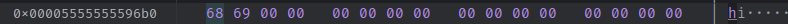

### Quelles données se trouvent sur la pile (stack) et sur le tas (heap)
```c

char *allocate_string(const char *string, int length) {
    char *alloc = calloc(length, sizeof(char));
    int test = 0;
    for(int i = 0; i<length;++i){
    	alloc[i] = string[i];
    }

    return alloc;
}

```
stack pointer est 0x00007fffffffe0b0.
address de `test` c'est 0x00007fffffffe0c0 qui est effectivement dans le stack, on voit que c'est ça descend en dessous du stack.
On voit que l'address de alloc c'est 0x00005555555596b0 donc dans le heap vu qu'on fait une allocation dynamique.



### Quelles instructions assemlbeur correspondent à "return 0"

```assembly
    1248:       b8 00 00 00 00          mov    $0x0,%eax
    124d:       c9                      leave  
    124e:       c3                      ret  
```

### Que corresponds les options de objdump et readelf

objdump -d -D 
```
               [-d|--disassemble[=symbol]]
               [-D|--disassemble-all]
```
readelf -a -h

```
       readelf [-a|--all]
               [-h|--file-header]
```


## Etape 7

### comparer les résultats obtenus.

La version sans optimisation, output est 
```bash
1 2 3 4
```
La version avec optimisation, output est
```bash
0 0 0 0
```
### Quel(s) est(sont) les différences au niveau du code C entre exo4-debug et exo4-optimized ? 

La différence c'est que dans la version optimisé, il nous manque la boucle for du début.

Code from debug

```assembly

    1185:	48 89 45 f8          	mov    %rax,-0x8(%rbp)
    1189:	31 c0                	xor    %eax,%eax
    118b:	c7 45 d0 00 00 00 00 	movl   $0x0,-0x30(%rbp)
    1192:	eb 30                	jmp    11c4 <main+0x5b> # jump à la fin de la boucle pour verifier la condition au début lorsqu'on rentre dans la boucle pour la première fois.
    1194:	83 7d d0 00          	cmpl   $0x0,-0x30(%rbp) # condition de comparaison pour le if (i == 0)
    1198:	75 26                	jne    11c0 <main+0x57> # jump à l'incrementation de la boucle for
    119a:	c7 45 e0 01 00 00 00 	movl   $0x1,-0x20(%rbp)
    11a1:	c7 45 e4 02 00 00 00 	movl   $0x2,-0x1c(%rbp)
    11a8:	c7 45 e8 03 00 00 00 	movl   $0x3,-0x18(%rbp)
    11af:	c7 45 ec 04 00 00 00 	movl   $0x4,-0x14(%rbp)
    11b6:	48 8d 45 e0          	lea    -0x20(%rbp),%rax
    11ba:	48 89 45 d8          	mov    %rax,-0x28(%rbp)
    11be:	eb 0a                	jmp    11ca <main+0x61> # break de la boucle for, jump en dehors de la boucle jusqu'à la prochaine instruction.
    11c0:	83 45 d0 01          	addl   $0x1,-0x30(%rbp)
    11c4:	83 7d d0 01          	cmpl   $0x1,-0x30(%rbp) # verification de la condition de la boucle
    11c8:	7e ca                	jle    1194 <main+0x2b> # jump vers la première instruction qui est le if dans la boucle for
    11ca:	c7 45 d4 00 00 00 00 	movl   $0x0,-0x2c(%rbp)
    11d1:	eb 33                	jmp    1206 <main+0x9d>
```

```assembly
    10a8:	41 8b 0c 9c          	mov    (%r12,%rbx,4),%ecx       # move 4 dans le variable pour la condition
    10ac:	89 da                	mov    %ebx,%edx
    10ae:	48 89 ee             	mov    %rbp,%rsi
    10b1:	bf 01 00 00 00       	mov    $0x1,%edi
    10b6:	31 c0                	xor    %eax,%eax
    10b8:	48 83 c3 01          	add    $0x1,%rbx                # incrementation de 1 pour la boucle
    10bc:	e8 af ff ff ff       	call   1070 <__printf_chk@plt>  
    10c1:	48 83 fb 04          	cmp    $0x4,%rbx                # compare the condition
    10c5:	75 e1                	jne    10a8 <main+0x28>         # jump not equals, retourner au debut de la boucle si la condition n'est pas egal.
    10c7:	48 8b 44 24 18       	mov    0x18(%rsp),%rax
    10cc:	64 48 2b 04 25 28 00 	sub    %fs:0x28,%rax
    10d3:	00 00 
    10d5:	75 0b                	jne    10e2 <main+0x62>
    10d7:	48 83 c4 20          	add    $0x20,%rsp
    10db:	31 c0                	xor    %eax,%eax
    10dd:	5b                   	pop    %rbx
    10de:	5d                   	pop    %rbp
    10df:	41 5c                	pop    %r12
    10e1:	c3                   	ret    
    10e2:	e8 79 ff ff ff       	call   1060 <__stack_chk_fail@plt>
    10e7:	66 0f 1f 84 00 00 00 	nopw   0x0(%rax,%rax,1)
```

### Exécuter chaque programme pas à pas en ouvrant le code désassemblé (vous pouvez aussi utiliser les outils vus à l’étape 4. Quel(s) est(sont) les différences d’exécution que vous observez ? Qu’observez-vous au niveau du code assembleur ? 

On peut voir que dans la boucle for de la boucle de la version d'optimisation, on ne fait pas un jump lorsqu'on rentre dans la boucle, on ne verifie pas la condition alors que dans le code assembleur du debug.

### Pouvez-vous trouver une explication pour le comportement que vous voyez ?  

Vu que la boucle for est hardcodé alors on peut enlevé quelques instructions. On ne verifie pas la condition de la boucle et on effectue directement comme on sait dans tout les cas on va rentrer dans la boucle. On enleve aussi la boucle du printf car on l'effectue une seule fois alors la boucle ne sert à rien.

### Quel est le bug de ce programme ? 

Le compilateur optimise et remove le buffer et le pointer car il y a un pointeur qui n'est plus aloué.

